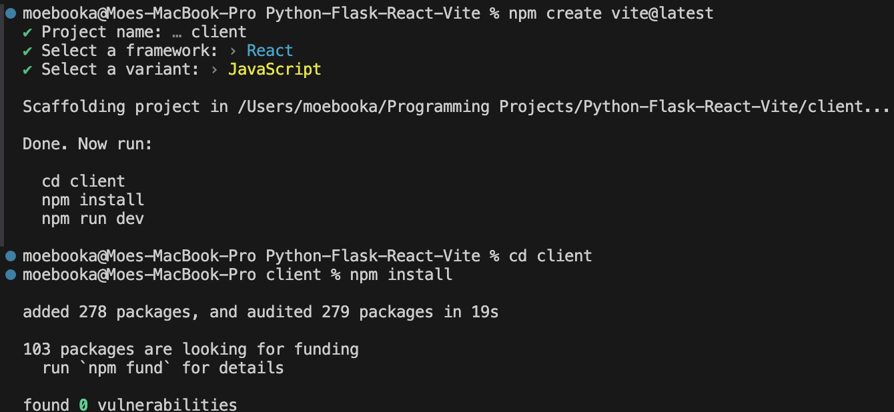
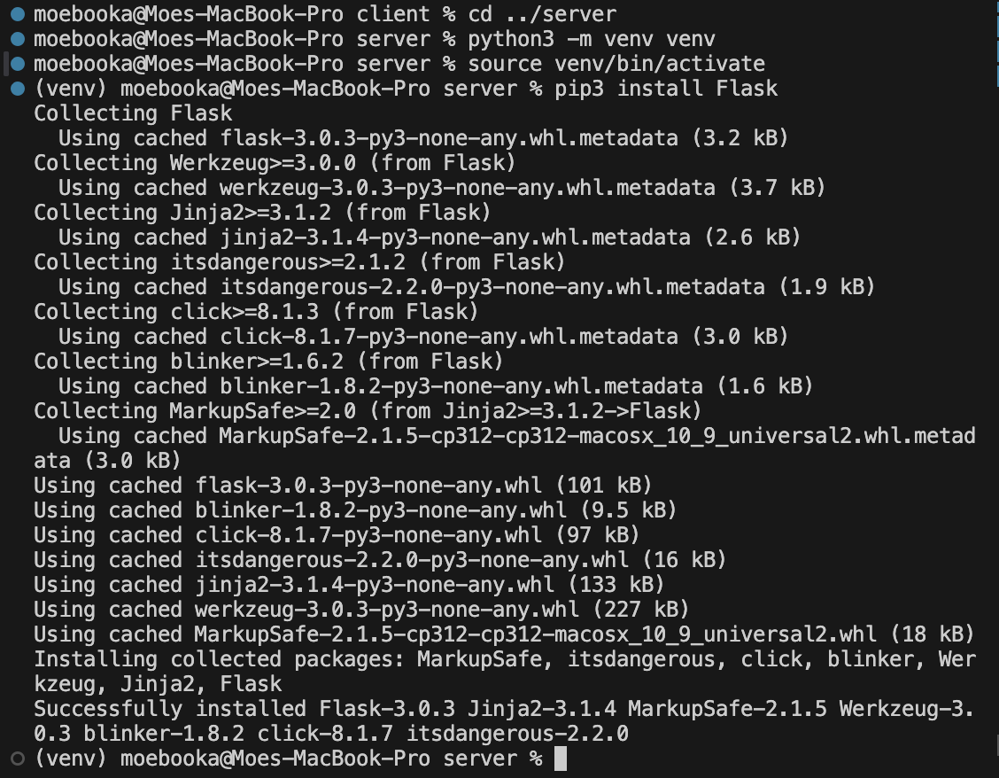
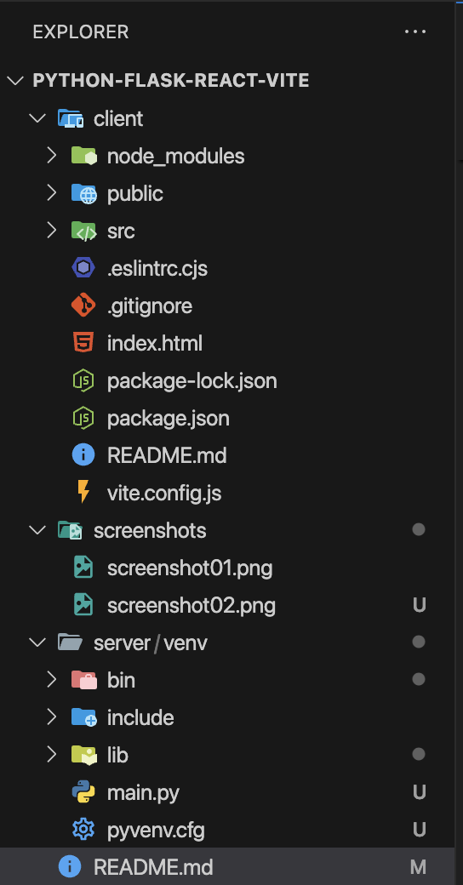
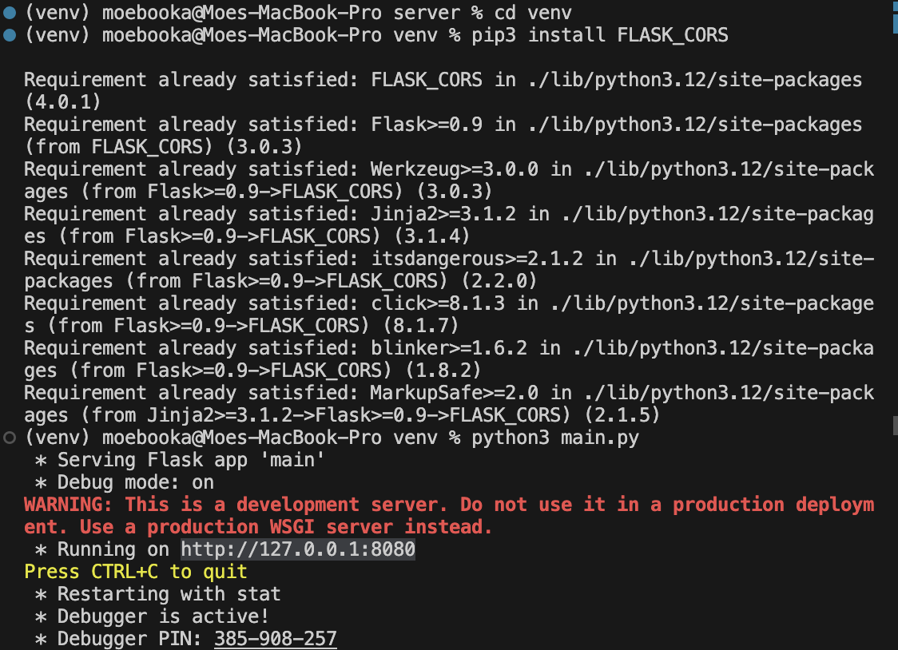
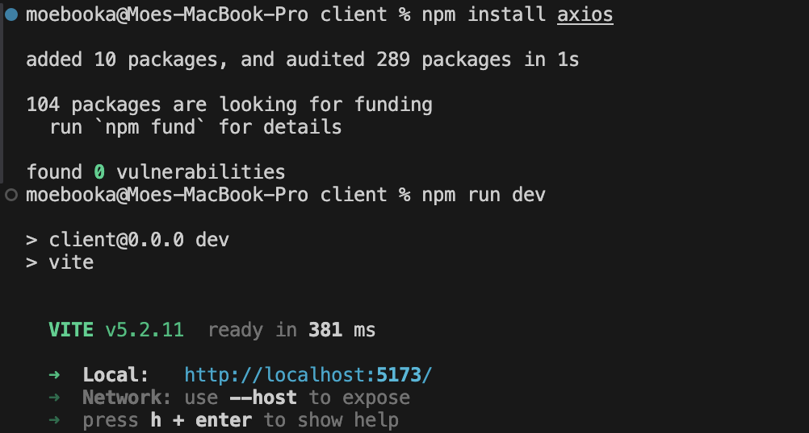
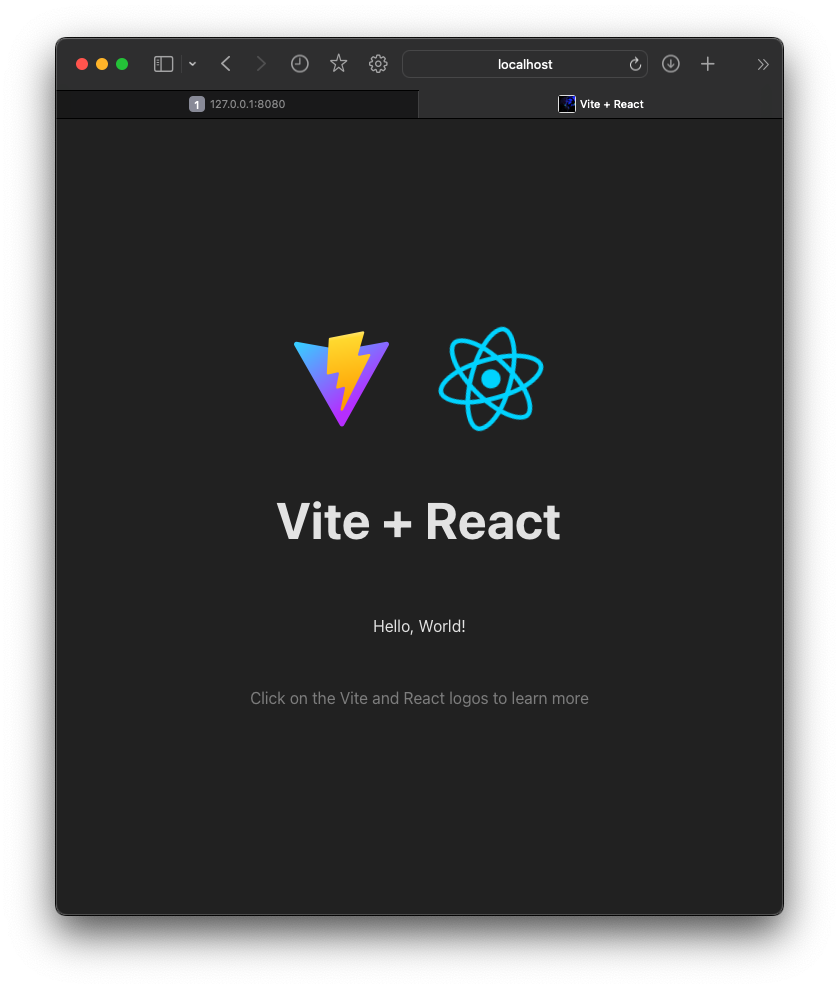

# Python-Flask-React-Vite

This is a step by step walkthrough on how to build a basic full-stack web application, with Python's Flask as backend and React and Vite as frontend.

## 1. Install Node.js

Vite requires Node.js. Install from: https://nodejs.org/en/download

## 2. Create the client - the React app

Open terminal window and run:

1. npm create vite@latest
2. **Project name:** client
3. **Framework:** React
4. **Variant:** Javascript
5. **Change dir to client:** cd client 
6. **Install node dependencies:** npm install

## 3. Create the server - Python's main.py

1. Create new folder inside the main folder and call it server
2. **Open split terminal and go to the server directory:** cd  ../server
3. **Create new python environment and call it venv for the sake of simplicity:** python3 -m venv venv
4. **Activate the environment:** source venv/bin/activate
5. **Install Flask:** pip3 install Flask (for mac) pip install Flask (for windows)
6. Create main.py file in the server folder - that's the file that will contain our backend code

That's how our program will be structured at last

## 4. The server code:

1. Write the code - comments are provided in the code for clarity
2. **In the server terminal go to venv dir, where the server side code is**: cd venv
3. **Next we need to enable cross origin request, which allows a server to indicate any origins (domain, scheme, or port) other than its own from which a browser should permit loading resources:** pip3 install FLASK_CORS
4. **Run server:** python3 main.py
5. The server is running at http://127.0.0.1:8080 as indicated in the terminal - load the address in your web browser

## 5. The client code:

1. **In the client terminal install axios to fetch API requests to our server:** npm install axios
2. Write React code in the client/src/assets/App.jsx file - comments were provided for the sake of simplicity
3. **Run React app:** npm run dev
4. Code from line 9 to 21 and 39 to 45 is the code responsible of fetching the message from the server and displaying it on the frontend
5. The app is running at http://localhost:5173/ as indicated in the terminal - load the address in your web browser

# Farewell

Hope this step by step by step walkthrough help you become a better programmer. This walkthrough was done with the help of https://www.youtube.com/watch?v=ctQMqqEo4G8 . Feel free to copy and edit the code as you wish. ✌️👾 
