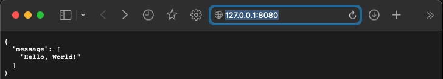

# Python-Flask-React-Vite

This is a step by step instruction on how to build a basic full-stack web application, with Python's Flask as backend and React and Vite as frontend.

## 1. Install Node.js

Vite requires Node.js. Install from: https://nodejs.org/en/download

## 2. Create the client - the React app

Open terminal window and run:

1. npm create vite@latest
2. **Project name:** client
3. **Framework:** React
4. **Variant:** Javascript
5. **Change dir to client:** cd client 
6. **Install node dependencies:** npm install

## 3. Create the server - Python's main.py

1. Create new folder inside the main folder and call it server
2. **Open split terminal and go to the server directory:** cd  ../server
3. **Create new python environment and call it venv for the sake of simplicity:** python3 -m venv venv
4. **Activate the environment:** source venv/bin/activate
5. **Install Flask:** pip3 install Flask (for mac) pip install Flask (for windows)
6. Create main.py file in the server folder - that's the file that will contain our backend code

That's how our program will be structured at last

## 4. The server code:

1. Write the code - comments are provided in the code for clarity
2. **Go to venv dir, where the server side code is**: cd venv
2. **Next we need to enable cross origin request, which allows a server to indicate any origins (domain, scheme, or port) other than its own from which a browser should permit loading resources:** pip3 install FLASK_CORS
3. **Run server:** python3 main.py
4. The server is running at http://127.0.0.1:8080 as indicated in the terminal - load the address in your web browser

